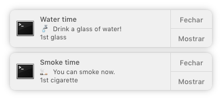
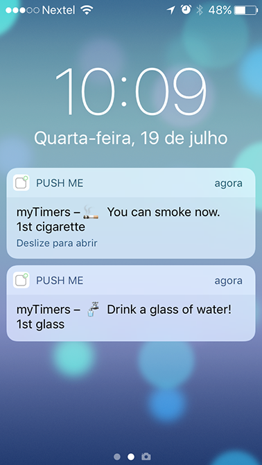
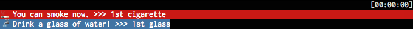

Smoke and the Water is a simple recurrent timer to help you to control how many cigarettes you 🚬 smoke, how many ☕️ coffee you drink and help you to remember you to drink pure clean 🚰 water.

Sure you can use it to remember daily stuff… but it was created for my own health needs 😬.

## Configuration

### Default configuration

The default configuration can be changed but can't be removed from the timers folder.

The default configurations are used only when a configuration is not set. For instance, you can set a single "endTime" for all your timers in the default.json and all timers will use this config. If you have a timer that needs a different "endTime", this configuration will overwrite the default.

## Configuring your timers

Configure or edit the other timers located in the timers folder.

```json
{
  "title": "Remember",
  "message": "🍰 The cake is a lie",
  "name": "lie remembered",
  "endTime": "23:30",
  "bgColor": "bgYellow",
  "quantity": 5,
  "reminders": [
    "00:30:00",
    "00:45:00",
    "01:00:00"
  ]
}
```
You should set:

- title: used in the desktop alert
- message: message for the alert used in all versions
- name: the name used to show how many times you did that timer
- endTime: when you want your timer to give the last alert in the day
- bgColor: terminal background color
- quantity: the number of times you want this to be repeated
- reminders: list with the repeat timers in "hh:mm:ss" format. If you have less timers than the number you set in `quantity`, the rest of the reminders will be distributed until the `endTime`. The time must use "hh:mm:ss" format.

## Mobile push
To use the mobile push you need to install the app [Push Me](http://pushme.jagcesar.se) and get your key. In the app, click on the key to copy to the clipboard.

Then you need to copy or rename the `.env.example` file to `.env` and insert your key.


## Usage

First, install all nee packages with `npm install`.

Then, create your timers (timers folder).

Finaly, run `npm start` and the app will run, alerting you in the computer and on your phone.

## Example
### Desktop alert

### Mobile push

### Terminal message


## TODO

### Mandatory

- ~~Calculate the remaining alerts~~
- Finish execution after all timers finish
- Check if all needed config are filled or have default values
- ~~Make sure `quantity` is smaller than the length of `reminders`~~
- Create tests
- Look for performance issues

### Nice to have

- Create better CLI interface
- Create config wizard

### Maybe in the future…

- Create Electron app
