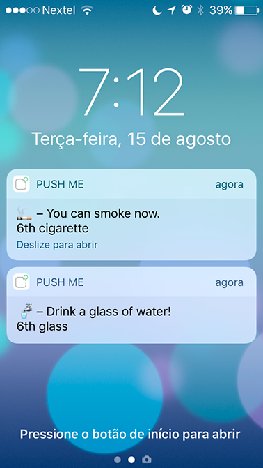

# MyTimer

MyTimer is a simple recurent timer to help you with daily tasks.

Use it to remember to drink water or when you can have your next cigarette (so you don't smoke more than you want).

## Configuration

First you need to edit or create configurations for each timers, like the ones located in the `timers` folder.

```json
{
  "title": "Smoke timer",
  "message": "🚬  You can smoke, now.",
  "name": "cigarette",
  "bgColor": "bgRed",
  "timeTable": [
    "00:30:00",
    "00:45:00",
    "01:00:00",
    "01:10:00",
    "01:10:00",
    "01:30:00"
  ]
}
```
You should set:

- title: used in the desktop alert
- message: message for the alert used in all versions
- name: the name used to show how mutch you did that timer
- bgColor: terminal background color
- timeTable: list with the repeat timers and the last enter in the time table is repeated

## Mobile push
To use the mobile push you need to install the app [Push Me](http://pushme.jagcesar.se) and get your key. In the app, click on the key to copy to the clipboard.

Then you need to copy or rename the `.env.example` file to `.env` and insert your key.


## Usage

Just run `npm start` and the app will run, alerting you in the computer and on your phone.

## Example
### Desktop alert

### Mobile push

### Terminal message

